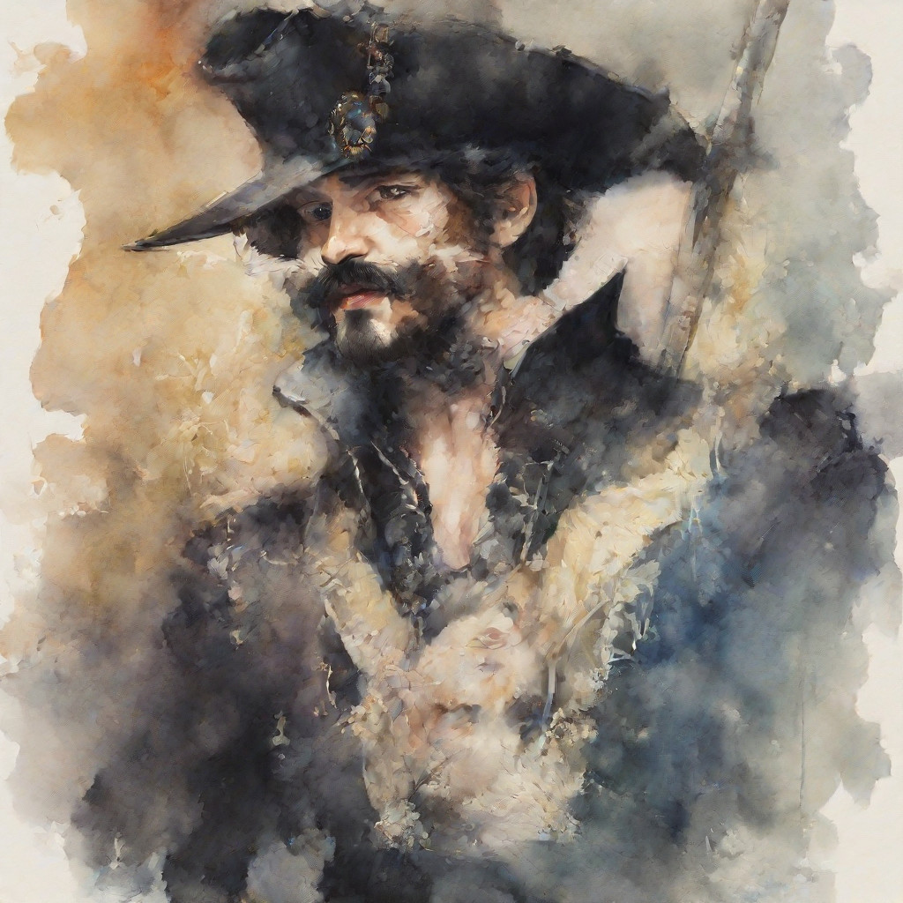
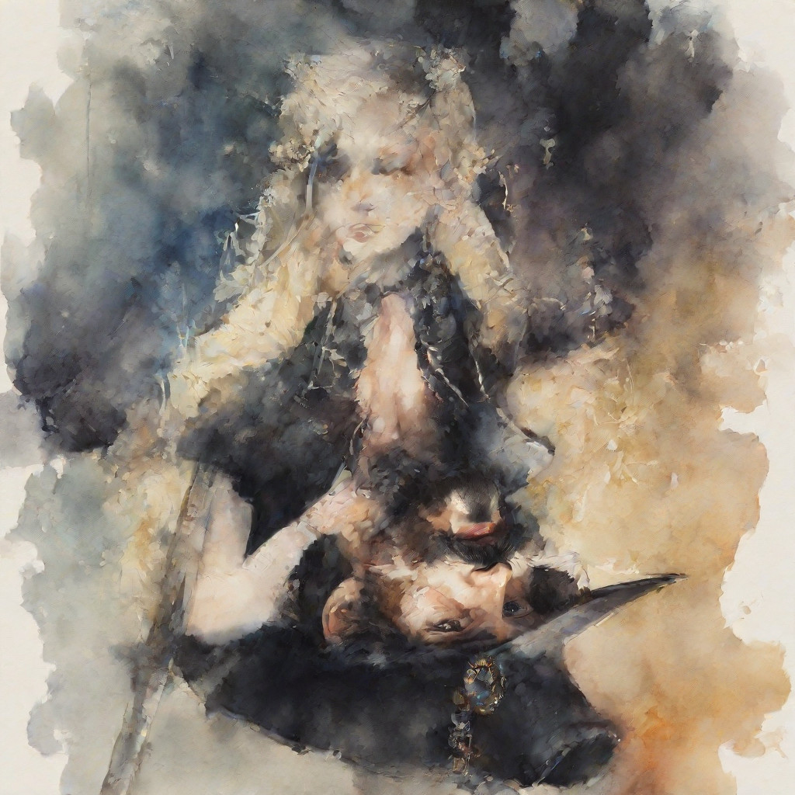
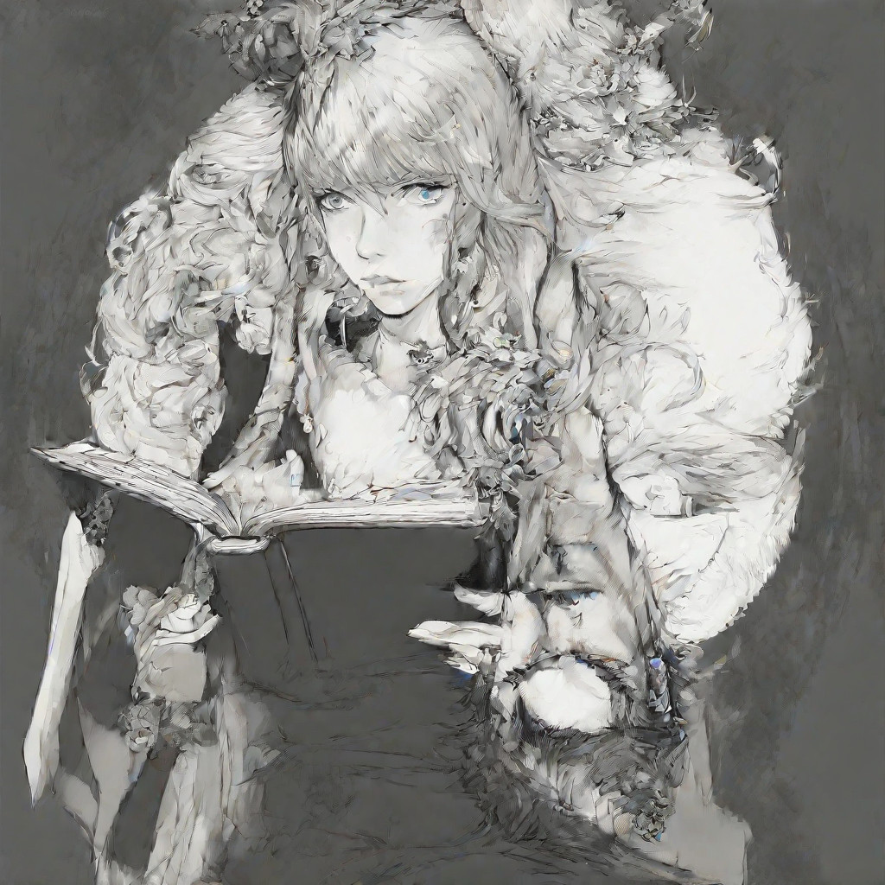
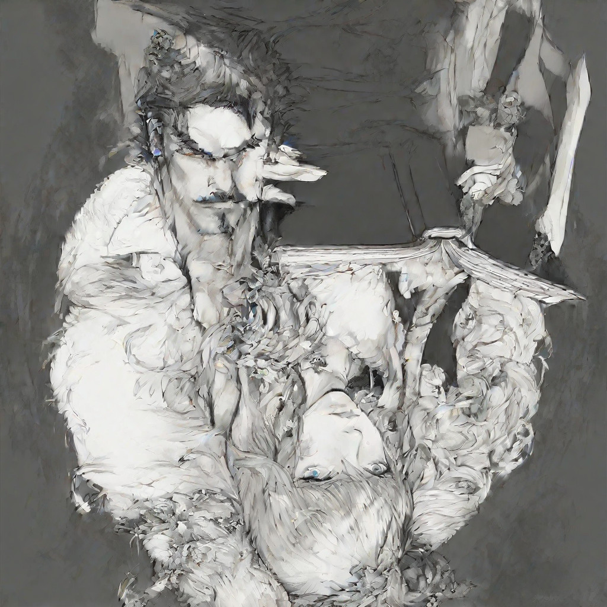
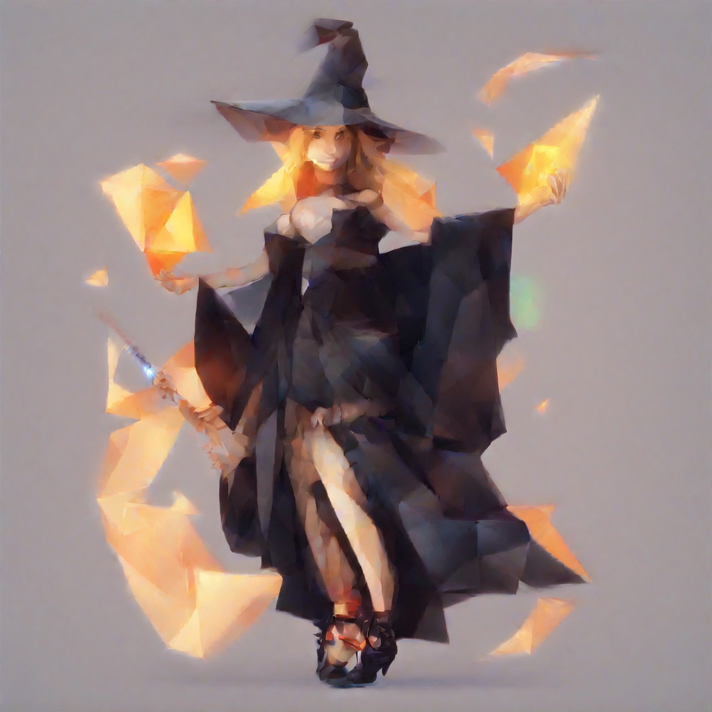
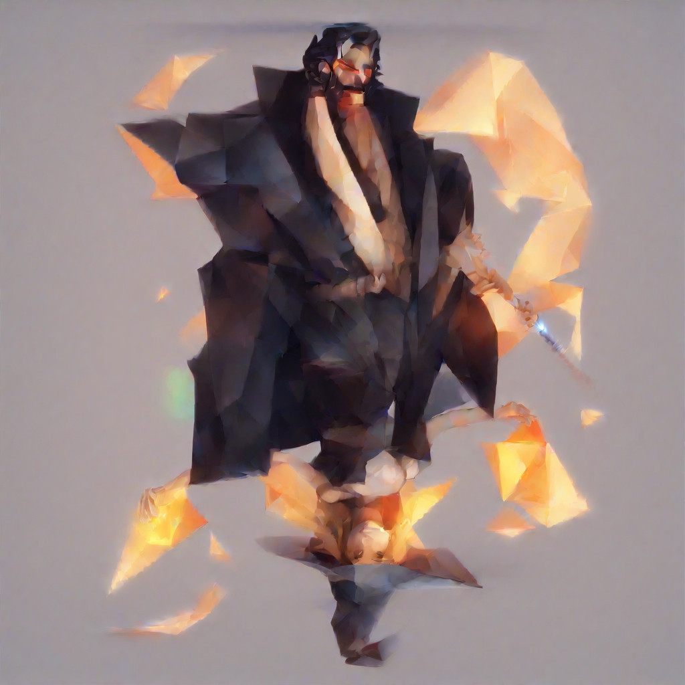
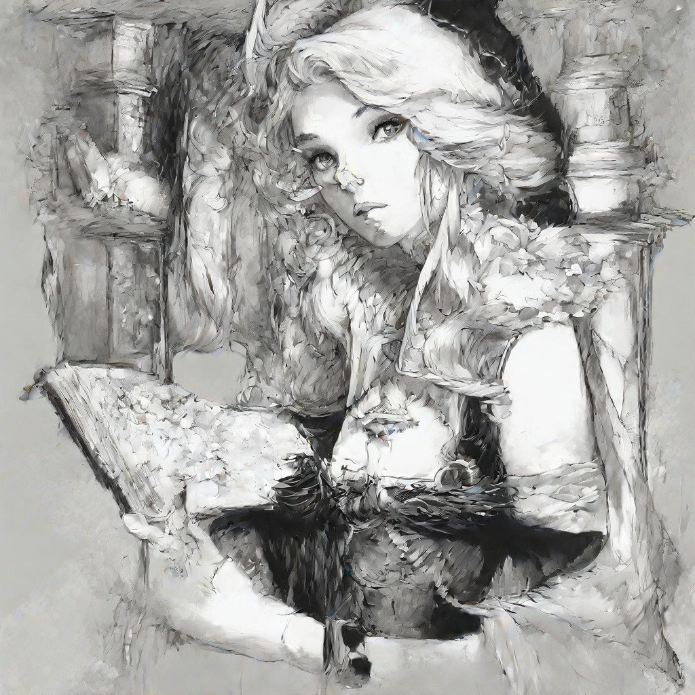
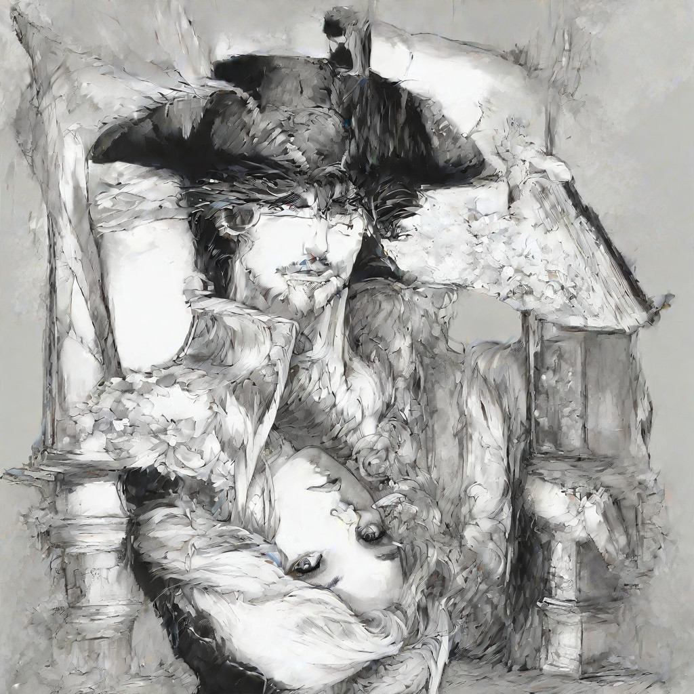

# sd-twist

Make optical illusions from two prompts in a given style: The generated
image shows the first prompt, but when you flip it on its head, it looks
like the second prompt.

The quality generally suffers from trying to achieve two goal prompts
simultaneously. Less detailed styles typically do a lot better -- realistic
styles tend to be just two images overlaid and pretty obvious.

This script is held together by bubblegum and vague hopes. It's currently
using stabilityai/stable-diffusion-xl-base-1.0 with a lot of hacks to get
the memory use down. It has been tried on a NVIDIA GeForce RTX 3080 and uses
~8GiB of VRAM.

```
options:
  -o OUTPUT, --output OUTPUT
                        Folder to create the images in. The script will happily delete
                        files, so beware.
  -s STYLES, --styles STYLES
                        Semicolon separated list of styles to try.
  -sf STYLES_FILE, --styles_file STYLES_FILE
                        File where each line is a style prompt to try.
  -p1 PROMPT1, --prompt1 PROMPT1
                        Semicolon separated list of first prompt to try.
  -p2 PROMPT2, --prompt2 PROMPT2
                        Semicolon separated list of second prompt to try.
  -p1f PROMPT1_FILE, --prompt1_file PROMPT1_FILE
                        File where each line is a first prompt to try.
  -p2f PROMPT2_FILE, --prompt2_file PROMPT2_FILE
                        File where each line is a second prompt to try.
  -np NEGATIVE_PROMPT, --negative_prompt NEGATIVE_PROMPT
                        Negative prompt applied to all generated images.
  -npf NEGATIVE_PROMPT_FILE, --negative_prompt_file NEGATIVE_PROMPT_FILE
                        File with a negative prompt applied to all generated images.
  -n NUM_IMAGES, --num_images NUM_IMAGES
                        Number of images to generate. If the combination of style x
                        prompt1 x prompt2 is larger than this, the script will pick a
                        random sample. If it's smaller, the script will generate
                        multiple images for some options.
  -i INFERENCE_STEPS, --inference_steps INFERENCE_STEPS
                        Number of inference steps. The best value depends on the style,
                        but 50 works pretty well in general.
  -t {flip,rot90}, --transform {flip,rot90}
                        Transform that reveals the second image. Can be "flip" or
                        "rot90".
```

```shell
sd-twist \
    -sf example_prompts/styles.list \
    -p1f example_prompts/prompt1.list \
    -p2f example_prompts/prompt2.list \
    -t flip
```













